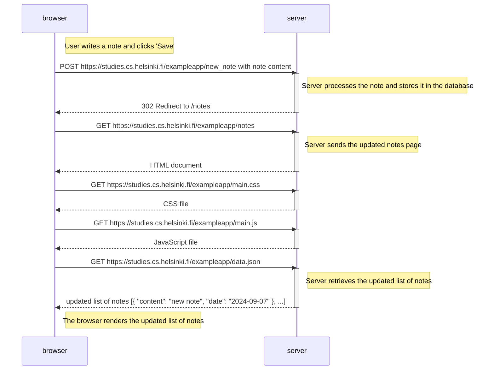
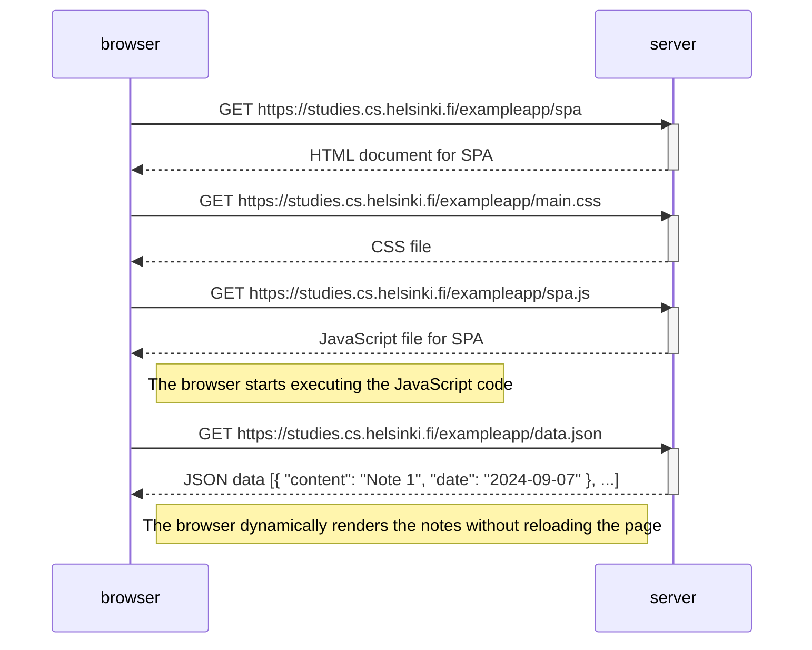
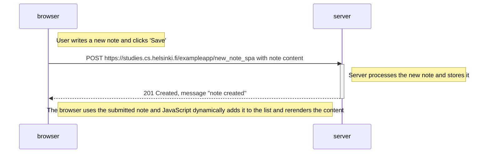

# Part 0 - Exercises

## 0.4: New note diagram

```mermaid
sequenceDiagram
    participant browser
    participant server

    Note right of browser: User writes a note and clicks 'Save'

    browser->>server: POST https://studies.cs.helsinki.fi/exampleapp/new_note with note content
    activate server
    Note right of server: Server processes the note and stores it in the database
    server-->>browser: 302 Redirect to /notes
    deactivate server

    browser->>server: GET https://studies.cs.helsinki.fi/exampleapp/notes
    activate server
    Note right of server: Server sends the updated notes page
    server-->>browser: HTML document
    deactivate server

    browser->>server: GET https://studies.cs.helsinki.fi/exampleapp/main.css
    activate server
    server-->>browser: CSS file
    deactivate server

    browser->>server: GET https://studies.cs.helsinki.fi/exampleapp/main.js
    activate server
    server-->>browser: JavaScript file
    deactivate server

    browser->>server: GET https://studies.cs.helsinki.fi/exampleapp/data.json
    activate server
    Note right of server: Server retrieves the updated list of notes
    server-->>browser: updated list of notes [{ "content": "new note", "date": "2024-09-07" }, ...]
    deactivate server

    Note right of browser: The browser renders the updated list of notes

```
## 0.5: Single Page App Diagram

```mermaid
sequenceDiagram
    participant browser
    participant server

    browser->>server: GET https://studies.cs.helsinki.fi/exampleapp/spa
    activate server
    server-->>browser: HTML document for SPA
    deactivate server

    browser->>server: GET https://studies.cs.helsinki.fi/exampleapp/main.css
    activate server
    server-->>browser: CSS file
    deactivate server

    browser->>server: GET https://studies.cs.helsinki.fi/exampleapp/spa.js
    activate server
    server-->>browser: JavaScript file for SPA
    deactivate server

    Note right of browser: The browser starts executing the JavaScript code

    browser->>server: GET https://studies.cs.helsinki.fi/exampleapp/data.json
    activate server
    server-->>browser: JSON data [{ "content": "Note 1", "date": "2024-09-07" }, ...]
    deactivate server

    Note right of browser: The browser dynamically renders the notes without reloading the page

```

## 0.6: New Note in a Single Page App Diagram

```mermaid
sequenceDiagram
    participant browser
    participant server

    Note right of browser: User writes a new note and clicks 'Save'

    browser->>server: POST https://studies.cs.helsinki.fi/exampleapp/new_note_spa with note content
    activate server
    Note right of server: Server processes the new note and stores it
    server-->>browser: 201 Created, message "note created"
    deactivate server

    Note right of browser: The browser uses the submitted note and JavaScript dynamically adds it to the list and rerenders the content
    
```